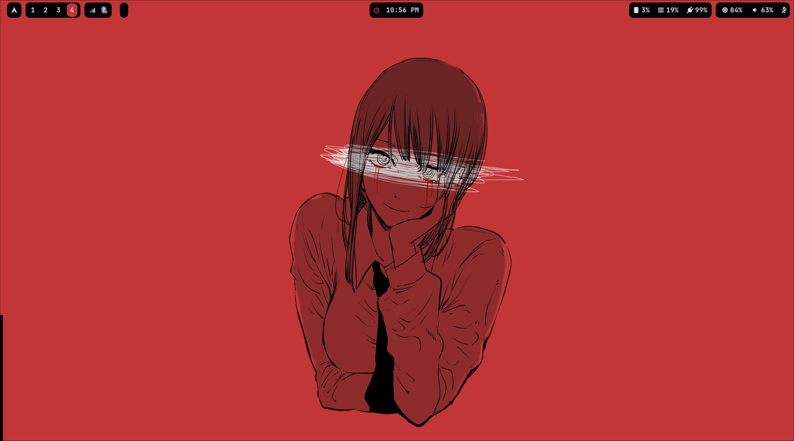
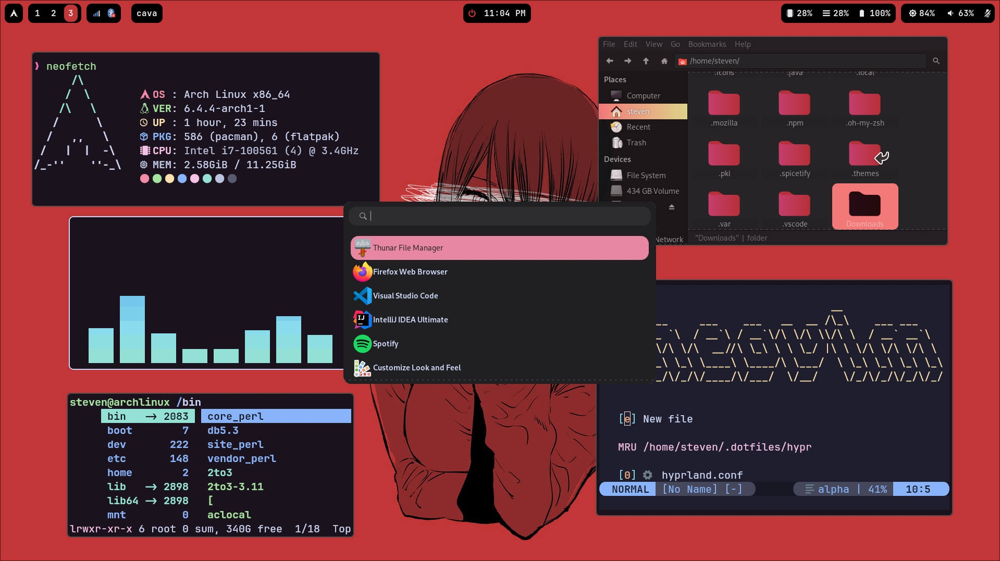
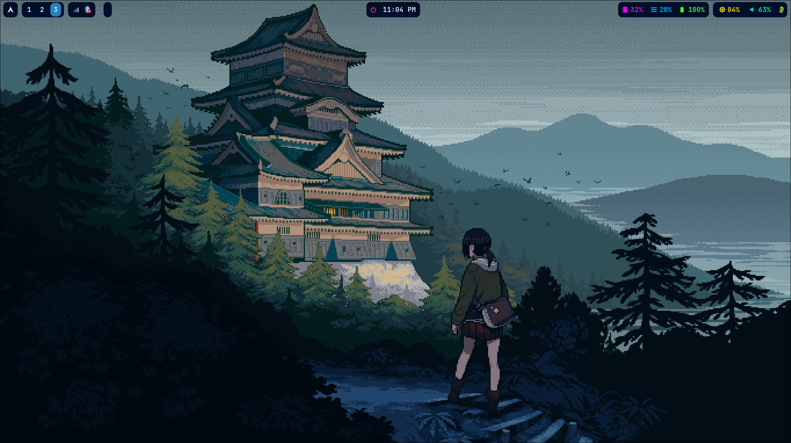
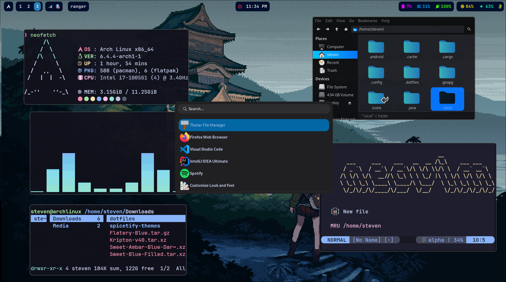

My ArchLinux setup :)

<h1 align="center">Environment</h1>

- **OS**: Arch Linux
- **Compositor**: Hyprland
- **Terminal**: Kitty
- **Launcher**: Wofi
- **Shell**: Zsh
- **Browser**: Firefox
- **Panel**: Waybar
- **File Manager**: Thunar

<h1 align="center">Showcase</h1>

|  |  |
| ------------------- | --------------------- |
|  |  |

---

#### Clone this repository

```
git clone https://github.com/StevenQuintanaGT/dotfiles/

```

---

### Wallpapers

https://www.wallpaperflare.com/chainsaw-man-makima-chainsaw-man-anime-girls-red-wallpaper-ymukg

https://www.wallpaperflare.com/anime-pixel-art-anime-girls-landscape-architecture-nature-wallpaper-cgtks

---
